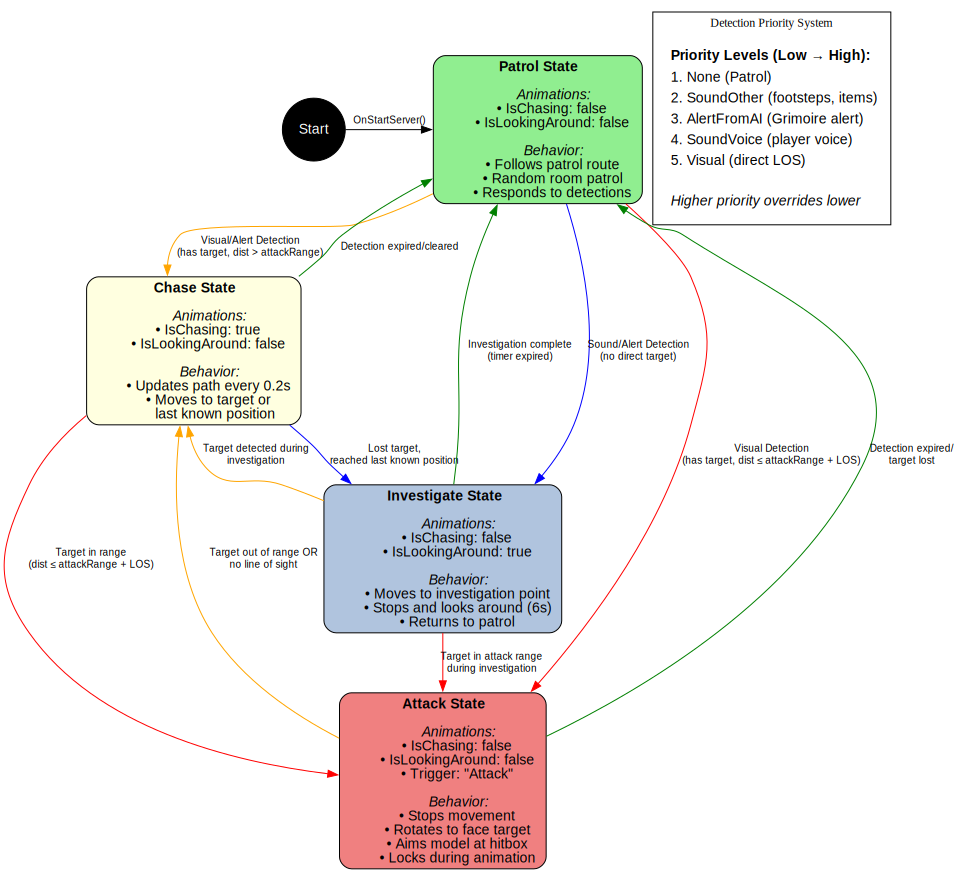

# NavMesh A* Pathfinding, State Machine & Voice Spell Casting System

## Project Overview

### Group

- José Miguel Pereira Silva Cunha (A22550)

---

### Introduction

The project explores some AI techniques commonly used in game development, most specifically in our game **Imperitus**. 

**Imperitus** is a solo or co-op first-person game where players take on the role of students at a prestigious, yet unforgiving magical academy. The players must solve puzzles, avoid enemies, and collect runes to learn the spells required for their classes.

This project will explore the following AI techniques:

1. **NavMesh Pathfinding** - Unity's A* algorithm implementation for enemy navigation
2. **Finite State Machine (FSM)** - Behavior management system for enemy AI
3. **Voice Recognition** - Speech-to-text integration for voice-activated spell casting

---

## 1. NavMesh & A* Pathfinding

### Overview

The project uses Unity's built-in NavMesh system, which implements the A* (A-star) pathfinding algorithm. This enables enemies to navigate complex 3D environments while avoiding obstacles and finding optimal paths to their targets or waypoints.

For the purpose of this project, I will specifically only mention the enemy Hanadura, from now on referred as HanaduraAI

### NavMeshAgent Component Setup

The NavMesh system in this project consists of several interconnected components that work together to enable enemy navigation.

#### NavMesh Agent (HanaduraAI)

Each HanaduraAI is equipped with a NavMeshAgent component configured with the "Hanadura" agent type. Key settings include:
- **Speed**: 3.5 units/second for base movement
- **Angular Speed**: 1200 degrees/second for smooth rotation
- **Acceleration**: 8 units/second² for responsive movement changes
- **Stopping Distance**: 1.2 (a little threshold to account for the size of the enemy)
- **Obstacle Avoidance**: High Quality with radius 0.5 and height 2.5
- **Auto Traverse Off Mesh Links**: Enabled for seamless navigation across gaps
- **Auto Repath**: Enabled to dynamically recalculate paths when blocked

The agent type defines a cylindrical approximation of the enemy (radius 0.5, height 1.0) used for collision detection and pathfinding calculations.

#### NavMesh Surface

A single NavMesh Surface is used to generate the walkable areas across all game rooms. The surface is configured to:
- Target the "Hanadura" agent type exclusively
- Collect geometry from "All Game Objects" within the scene
- Use layers: Default, Ground, Draggable, and Sound
- Maintain a voxel size of approximately 0.167 (3 voxels per agent radius)
- Generate navigation data with a tile size of 256 world units

The surface is baked once during development and defines where enemies can and cannot walk throughout the environment.

#### NavMesh Modifiers

NavMesh Modifiers were applied to static furniture objects to control pathfinding behavior:
- **Bookshelves and Tables**: Marked as "Not Walkable" areas, causing the NavMesh Surface to exclude these objects entirely from the walkable mesh
- **Doors**: Initially attempted as NavMesh Obstacles, but this prevented enemies from recognizing doors as passable. The solution was to use modifiers to exclude doors from the mesh generation entirely, allowing enemies to push through them naturally during pathfinding

This approach ensures enemies navigate around solid furniture while being able to interact with dynamic objects like doors.

#### NavMesh Obstacles

NavMesh Obstacles were used for movable objects that need to dynamically affect pathfinding:
- **Chairs**: Configured as Box-shaped obstacles with carving enabled
  - **Move Threshold**: 0.1 units (triggers repath when moved more than 10cm)
  - **Time To Stationary**: 0.5 seconds (waits before updating NavMesh)
  - **Carve**: Enabled to cut holes in the NavMesh in real-time

When a chair is moved (by physics or player interaction), the NavMesh Obstacle automatically updates the navigation mesh, forcing nearby enemies to recalculate their paths around the new obstacle position. This creates dynamic, reactive pathfinding that responds to environmental changes during gameplay.

### NavMeshAgent Methods 

The HanaduraAI implements basic public methods used across the enemy codebase that manipulate the agent's position and state

```csharp
public void MoveTo(Vector3 position)
{
    if (!base.IsServerInitialized) return;
    navAgent.isStopped = false;
    navAgent.SetDestination(position);
}

public void StopMovement()
{
    if (!base.IsServerInitialized) return;
    navAgent.isStopped = true;
}
```

#### NavMesh Summary
- **Dynamic Pathfinding**: Enemies recalculate paths periodically when chasing targets to account for player movement
- **Obstacle Avoidance**: NavMesh automatically handles collision avoidance with static geometry
- **Static vs Dynamic Objects**: Static furniture uses modifiers for performance (baked once), while dynamic objects use obstacles for runtime flexibility
- **NavMesh Modifiers**: Define unwalkable or avoidable areas in the environment (e.g., bookshelves, tables, ceilings...)
- **Patrol Routes**: Enemies follow waypoint paths generated dynamically using NavMesh navigation
- **Multi-Room Navigation**: System supports complex level layouts with dynamic room-to-room patrolling
- **Environmental Interaction**: Doors are excluded from the mesh to allow natural physical interaction as enemies push through them
- **Adaptive Navigation**: Obstacle avoidance ensures smooth navigation around moving objects like chairs

---

## 2. Finite State Machine (FSM)

### Overview

The HanaduraAI uses a Finite State Machine to manage different behavioral states. This architecture enables complex, context-aware behavior while maintaining clean, modular code. Each state is completely self-contained, making the system easier to debug and extend if necessary (like creating new states in future development)

### State Architecture

#### State Interface

All states implement a common interface defined in `IEnemyState.cs`:

```csharp
public interface IEnemyState
{
    void Enter();  // Called when transitioning into this state
    void Exit();   // Called when transitioning out of this state
    void Tick();   // Called every frame while in this state
}
```

This contract ensures every state can be cleanly initialized, cleaned up, and updated, providing a consistent lifecycle for all behaviors.

### State Implementations

#### 1. Patrol State

**Purpose**: Default idle behavior where the enemy follows predefined waypoint routes.

**Key Implementation** (from `PatrolState.cs`):

```csharp
public class PatrolState : IEnemyState
{
    private HanaduraAI ai;
    private PatrolRoute route;
    private int currentIndex;
    private bool loop;
    
    public PatrolState(HanaduraAI ai, PatrolRoute route, bool loop, int startIndex = 0)
    {
        this.ai = ai;
        this.route = route;
        this.loop = loop;
        this.currentIndex = startIndex;
    }
}
```

The state stores references to the AI controller, the patrol route (collection of waypoint transforms), whether to loop the route, and the current waypoint index. The constructor allows flexible initialization with custom starting waypoints.

**Tick Method** (from `PatrolState.cs`):

```csharp
public void Tick()
{
    if (route == null || route.Count == 0) return;
    Transform wp = route.GetWaypoint(currentIndex);
    if (wp == null) return;
    float dist = Vector3.Distance(ai.transform.position, wp.position);
    
    if (dist <= ai.navAgent.stoppingDistance)
    {
        currentIndex++;
        if (currentIndex >= route.Count)
        {
            if (loop)
                currentIndex = 0;
            else
            {
                ai.StopMovement();
                return;
            }
        }
        MoveToCurrentWaypoint();
    }
}
```

Every frame, `Tick()` checks if the enemy is within stopping distance of the current waypoint. When reached, it advances to the next waypoint. If the route is set to loop, it wraps back to index 0; otherwise, the enemy stops at the final waypoint.

**Exit Method** (from `PatrolState.cs`):

```csharp
public void Exit()
{
}
```

The patrol state requires no cleanup when exiting, as movement is handled by the NavMeshAgent and will be controlled by the next state that enters.

---

#### 2. Chase State

**Purpose**: Activated when the enemy detects a target. Continuously pursues the target's position.

**Key Implementation** (from `ChaseState.cs`):

```csharp
public class ChaseState : IEnemyState
{
    private HanaduraAI ai;
    private float updateInterval = 0.2f;
    private float updateTimer = 0f;
    
    public void Enter()
    {
        updateTimer = 0f;
        ai.SetAnimatorBool("IsChasing", true);
        ai.SetAnimatorBool("IsLookingAround", false);
    }
}
```

The chase state maintains an update timer to control pathfinding frequency. Setting `IsChasing` to true triggers the running animation on the enemy model.

**Tick Method** (from `ChaseState.cs`):

```csharp
public void Tick()
{
    // Determine target position
    Vector3? targetPos = ai.CurrentTarget != null
        ? ai.CurrentTarget.position
        : ai.LastKnownTargetPosition;
    
    if (!targetPos.HasValue)
    {
        Logger.Warning("[ChaseState] No target position available!");
        return;
    }
    
    // Update path periodically
    updateTimer -= Time.deltaTime;
    if (updateTimer <= 0f)
    {
        updateTimer = updateInterval;
        ai.MoveTo(targetPos.Value);
    }
    
    // Check if reached last known position (when no direct target)
    if (ai.CurrentTarget == null && ai.LastKnownTargetPosition.HasValue)
    {
        float dist = Vector3.Distance(ai.transform.position, ai.LastKnownTargetPosition.Value);
        if (dist <= ai.navAgent.stoppingDistance + 0.5f)
        {
            Logger.Info("[ChaseState] Reached last known position.");
        }
    }
}
```

The path is recalculated every 0.2 seconds rather than every frame, preventing excessive pathfinding calculations while maintaining responsive pursuit. The system can chase either a live target or the last known position where the target was seen. When the last known position is reached without regaining visual contact, the detection priority system will determine the next appropriate state transition.

**Exit Method** (from `ChaseState.cs`):

```csharp
public void Exit()
{
    ai.SetAnimatorBool("IsChasing", false);
}
```

When exiting chase state, the running animation is disabled, returning the enemy to its idle animation state.

---

#### 3. Attack State

**Purpose**: Engaged when target is within attack range AND line of sight. Handles rotation, aiming, and attack execution.

**Key Implementation** (from `AttackState.cs`):

```csharp
public class AttackState : IEnemyState
{
    private HanaduraAI ai;
    private bool hasAttacked = false;
    private float rotationSpeed = 8f;
    private float minRotationThreshold = 5f;
    
    public void Enter()
    {
        ai.StopMovement();
        ai.SetAnimatorBool("IsChasing", false);
        ai.SetAnimatorBool("IsLookingAround", false);
        hasAttacked = false;
    }
}
```

The state immediately stops movement and resets the attack flag. The rotation parameters control how quickly the enemy aims at the target (8 units/second) and the minimum angle threshold (5 degrees) required before attacking.

**Tick Method** (from `AttackState.cs`):

```csharp
public void Tick()
{
    if (ai.CurrentTarget == null) return;
    if (!ai.navAgent.isStopped)
    {
        ai.StopMovement();
    }
    
    // Horizontal rotation (body facing target)
    Vector3 horizontalDir = (ai.CurrentTarget.position - ai.transform.position);
    horizontalDir.y = 0f;
    if (horizontalDir.sqrMagnitude > 0.001f)
    {
        Quaternion horizontalLook = Quaternion.LookRotation(horizontalDir);
        ai.transform.rotation = Quaternion.Slerp(
            ai.transform.rotation,
            horizontalLook,
            Time.deltaTime * 10f
        );
    }
    
    // Vertical rotation (model aiming at target)
    Quaternion targetLocalRotation = Quaternion.identity;
    bool isAimedAtTarget = false;
    if (ai.modelTransform != null)
    {
        Vector3 attackOrigin = ai.RaycastOrigin.position;
        Vector3 targetCenter = ai.CurrentTarget.GetComponentInParent<PlayerCharacter>().RaycastTarget.position + Vector3.up * 1.5f;
        Vector3 worldDirection = (targetCenter - attackOrigin).normalized;
        Vector3 localDirection = ai.transform.InverseTransformDirection(worldDirection);
        
        if (localDirection.sqrMagnitude > 0.001f)
        {
            targetLocalRotation = Quaternion.LookRotation(localDirection);
            Quaternion newRotation = Quaternion.Slerp(
                ai.modelTransform.localRotation,
                targetLocalRotation,
                Time.deltaTime * rotationSpeed
            );
            ai.SyncModelRotation(newRotation);
            
            float rotationDifference = Quaternion.Angle(ai.modelTransform.localRotation, targetLocalRotation);
            isAimedAtTarget = rotationDifference < minRotationThreshold;
        }
    }
    
    // Execute attack when properly aimed
    if (isAimedAtTarget && ai.TryPerformAttack())
    {
        if (!hasAttacked)
        {
            ai.SetAnimatorTrigger("Attack");
            ai.LockIntoAttack();
            hasAttacked = true;
        }
    }
    else
    {
        hasAttacked = false;
    }
}
```

The attack state uses a two-phase rotation system: the enemy's body rotates horizontally to face the target, while the model rotates independently to aim vertically at the target's center mass (1.5 units above the raycast target). The attack only executes when the aiming angle is within 5 degrees of the target and the attack cooldown permits it. The `hasAttacked` flag prevents attack spam and is reset when the enemy loses proper aim.

**Exit Method** (from `AttackState.cs`):

```csharp
public void Exit()
{
    if (ai.weaponCollider != null)
    {
        ai.weaponCollider.DisableWeapon();
    }
    if (ai.modelTransform != null)
    {
        ai.modelTransform.localRotation = Quaternion.Slerp(
            ai.modelTransform.localRotation,
            Quaternion.identity,
            Time.deltaTime * rotationSpeed
        );
    }
}
```

When exiting the attack state, the weapon collider is disabled to prevent unintended damage, and the model's vertical rotation is smoothly reset to its neutral position (identity rotation).

---

#### 4. Investigate State

**Purpose**: Explores positions where sounds or alerts were detected. Used when the enemy doesn't have direct visual contact.

**Key Implementation** (from `InvestigateState.cs`):

```csharp
public class InvestigateState : IEnemyState
{
    private readonly HanaduraAI owner;
    private float investigateTimer;
    private readonly float investigateDuration = 6f;
    private readonly float stopDistance = 1.5f;
    private Vector3 investigatePoint;
    private bool hasReachedPoint = false;
    private bool investigationComplete = false;
    
    public bool IsInvestigationComplete => investigationComplete;
}
```

The state tracks whether the investigation point has been reached and whether the full investigation timer has expired. This allows the main AI controller to know when investigation is finished. The 6-second duration gives the enemy time to "search" the area realistically.

**Tick Method** (from `InvestigateState.cs`):

```csharp
public void Tick()
{
    // Check if reached investigation point
    if (!hasReachedPoint)
    {
        if (!owner.navAgent.pathPending && 
            owner.navAgent.remainingDistance <= stopDistance)
        {
            hasReachedPoint = true;
            owner.StopMovement();
            owner.SetAnimatorBool("IsLookingAround", true);
            Logger.Info("[InvestigateState] Reached investigation point, looking around...");
        }
    }
    else
    {
        // Wait at the investigation point
        investigateTimer -= Time.deltaTime;
        if (investigateTimer <= 0f && !investigationComplete)
        {
            investigationComplete = true;
            Logger.Info("[InvestigateState] Investigation timer expired - ready to transition.");
        }
    }
}
```

The investigation has two phases: navigation (moving to the point) and inspection (staying and "looking around" for 6 seconds). The state only marks investigation as complete after both phases finish. The `IsInvestigationComplete` property signals the FSM manager that it's safe to transition back to patrol or respond to new detections.

**Exit Method** (from `InvestigateState.cs`):

```csharp
public void Exit()
{
    owner.SetAnimatorBool("IsLookingAround", false);
    Logger.Info("[InvestigateState] Finished investigating.");
}
```

When exiting, the "looking around" animation is disabled and investigation completion is logged for debugging purposes.
### State Management System

#### State Initialization

All states are created when the server initializes the AI (from `HanaduraAI.cs`):

```csharp
public override void OnStartServer()
{
    base.OnStartServer();
    
    // Ensure components exist
    if (navAgent == null) navAgent = GetComponent<NavMeshAgent>();
    if (detection == null) detection = GetComponent<EnemyDetection>();
    
    // Create states
    patrolState = new PatrolState(this, patrolRoute, loopPatrol, startWaypointIndex);
    chaseState = new ChaseState(this);
    attackState = new AttackState(this);
    investigateState = new InvestigateState(this);
    
    EnterState(patrolState);
}
```

This ensures all state objects are instantiated once and reused throughout the AI's lifetime, avoiding multiple instances of the same states that would increase the memory usage of the game over time.

#### State Transitions

The `EnterState()` method (from `HanaduraAI.cs`) handles clean state transitions:

```csharp
public void EnterState(IEnemyState newState)
{
    if (currentState != null)
        currentState.Exit();
    
    currentState = newState;
    
    if (currentState != null)
    {
        Logger.Info($"[HanaduraAI] Entered state: {currentState.GetType().Name}");
        currentState.Enter();
    }
}
```

This ensures the previous state's `Exit()` method is always called before entering a new state, allowing proper cleanup of animations, movement, and other state-specific behaviors.
All state transitions are done using this method.

### Priority-Based Detection System

The FSM uses a static and predefined priority system to determine which state to enter based on the type of detection. This system is set in `HanaduraAI.cs`:

```csharp
public enum DetectionPriority
{
    None = 0,
    Patrol = 1,
    SoundOther = 2,      // Footsteps, items, etc.
    AlertFromAI = 3,     // Another AI reported something
    SoundVoice = 4,      // Player voice chat
    Visual = 5           // Direct line of sight
}
```

Visual detection has the highest priority, meaning if an enemy both hears a sound and sees a player, it will prioritize the visual detection.

#### Detection Info Structure

Each detection stores comprehensive information (from `HanaduraAI.cs`):

```csharp
public class DetectionInfo
{
    public DetectionPriority priority;
    public Vector3 position;
    public Transform target;        // null for sounds/alerts without direct target
    public float metric;            // intensity for sounds, distance for visual/alerts
    public float timestamp;
    
    public DetectionInfo(DetectionPriority priority, Vector3 position, 
                         Transform target = null, float metric = 0f)
    {
        this.priority = priority;
        this.position = position;
        this.target = target;
        this.metric = metric;
        this.timestamp = Time.time;
    }
}
```

The `metric` field serves different purposes depending on detection type: for sounds it stores intensity, for visual detections it stores distance. The timestamp allows detections to expire after a configurable duration.

#### Detection Switching Logic

The system decides whether to switch to a new detection using logical specific conditions (from `HanaduraAI.cs`):

```csharp
private bool ShouldSwitchToNewDetection(DetectionInfo newDetection)
{
    // No current detection, always switch
    if (currentDetection == null)
        return true;
    
    // Check if current detection has expired
    if (IsDetectionStale(currentDetection))
    {
        return true;
    }
    
    // Higher priority always wins
    if (newDetection.priority > currentDetection.priority)
    {
        return true;
    }
    
    if (newDetection.priority < currentDetection.priority)
        return false;
    
    // Same priority - use tie-breaker
    if (newDetection.priority == DetectionPriority.Visual ||
        newDetection.priority == DetectionPriority.AlertFromAI)
    {
        // Use distance for visual/alerts (closer wins)
        float currentDist = Vector3.Distance(transform.position, currentDetection.position);
        float newDist = Vector3.Distance(transform.position, newDetection.position);
        
        if (newDist < currentDist)
        {
            return true;
        }
        return false;
    }
    else if (newDetection.priority == DetectionPriority.SoundVoice ||
             newDetection.priority == DetectionPriority.SoundOther)
    {
        // Use intensity for sounds (louder wins)
        if (newDetection.metric > currentDetection.metric)
        {
            return true;
        }
        return false;
    }
    
    return false; // Default: don't switch
}
```

This tie-breaking logic ensures the correct behavior when multiple detections of the same priority occur: the enemy prioritizes closer visual targets but louder sounds. (Check if true)

#### State Selection from Detection

The main update loop determines which state to enter based on current detection (from `HanaduraAI.cs`):

```csharp
private void UpdateStateFromDetection()
{
    if (currentDetection == null)
    {
        // No detection, return to patrol
        if (!(currentState is PatrolState))
        {
            EnterState(patrolState);
        }
        return;
    }
    
    // Handle based on detection priority
    switch (currentDetection.priority)
    {
        case DetectionPriority.Visual:
            HandleVisualDetection();
            break;
        
        case DetectionPriority.SoundVoice:
        case DetectionPriority.SoundOther:
        case DetectionPriority.AlertFromAI:
            HandleInvestigationDetection();
            break;
    }
}
```

Visual detections lead to chase/attack states, while non-visual detections lead to investigation states.

**Visual Detection Handler** (from `HanaduraAI.cs`):

```csharp
private void HandleVisualDetection()
{
    if (CurrentTarget == null) return;
    if (isAttackLocked) return;
    
    float dist = Vector3.Distance(transform.position, CurrentTarget.position);
    
    // Check if we can actually attack (distance AND line of sight)
    bool canAttack = dist <= attackRange &&
                     detection.HasLineOfSightOfHitbox(CurrentTarget, RaycastOrigin);
    
    if (canAttack)
    {
        if (!(currentState is AttackState))
            EnterState(attackState);
    }
    else
    {
        // Either too far OR no line of sight -> chase
        if (!(currentState is ChaseState))
            EnterState(chaseState);
    }
}
```

This ensures the enemy only attempts to attack when both within range AND has clear line of sight to the target's hitbox, preventing attacks through walls or obstacles.



### FSM Summary

- **Clear Separation of Concerns**: Each behavior is isolated in its own state class, making the codebase easier to understand and maintain
- **Easy Debugging**: Current state is always clearly defined and logged, making it simple to track AI behavior issues
- **Extensibility**: New states can be added by implementing `IEnemyState` without modifying existing code
- **Predictable Behavior**: Transitions follow clear, testable rules defined by the priority system
- **Performance**: State objects are instantiated once and reused, minimizing garbage collection
- **Network Compatibility**: Designed to work with FishNet networking, ensuring server-authoritative AI behavior

---

## 3. Voice Detection & Speech Recognition

### Overview

The voice control system enables players to cast spells using voice commands. It integrates the Vosk speech recognition library to process real-time audio input and translate spoken spell names into game actions.

### Vosk Integration

The system uses **Vosk**, an offline speech recognition toolkit:

- Runs entirely locally (no cloud API calls)
- Supports custom language models (using `en-US` model stored in `StreamingAssets/LanguageModels`)
- Provides confidence scores for each recognition
- Can operate in grammar mode (restricted vocabulary) or free-form mode

**Initialization** (from `VoskSpeechToText.cs`):

```csharp
// Initialize recognizer with or without grammar
if (string.IsNullOrEmpty(m_grammar))
{
    m_recognizer = new VoskRecognizer(m_model, 16000.0f);
}
else
{
    m_recognizer = new VoskRecognizer(m_model, 16000.0f, m_grammar);
}
```

The recognizer operates at 16kHz sample rate, which provides a good balance between accuracy and performance for speech recognition.

---

### Architecture

The voice recognition system consists of three main components working together:

#### VoiceProcessor

**Purpose**: Captures and processes microphone input in real-time.

**Key Features** (from `VoiceProcessor.cs`):
- Captures microphone input at 16kHz sample rate
- Delivers audio frames of 512 samples for processing
- Implements voice activity detection (VAD) using volume threshold
- Detects silence periods to determine when player stops speaking
- Supports multiple audio input devices with runtime device switching

**Audio Buffer Management** (from `VoiceProcessor.cs`):

```csharp
IEnumerator RecordData()
{
    float[] sampleBuffer = new float[FrameLength];
    int startReadPos = 0;

    OnRecordingStart?.Invoke();

    while (IsRecording)
    {
        int curClipPos = Microphone.GetPosition(CurrentDeviceName);
        if (curClipPos < startReadPos)
            curClipPos += m_audioClip.samples;

        int samplesAvailable = curClipPos - startReadPos;
        if (samplesAvailable < FrameLength)
        {
            yield return null;
            continue;
        }

        // Process frame...
    }
}
```

The processor uses a circular buffer approach to continuously read audio data without gaps, handling wrap-around cases when the microphone buffer loops back to the beginning.

#### VoskSpeechToText

**Purpose**: Processes audio frames using the Vosk recognition engine.

**Key Features** (from `VoskSpeechToText.cs`):
- Processes audio frames using Vosk recognition engine
- Converts speech to text with confidence scores
- Supports keyword filtering (grammar mode) for restricted vocabulary
- Runs recognition on background thread for performance (doesn't block main thread)
- Provides three types of results: partial (during speech), intermediate (sentence boundaries), and final (when recording stops)

**Threading Architecture** (from `VoskSpeechToText.cs`):

```csharp
private async Task ThreadedWork()
{
    // Initialize recognizer once
    if (!m_recognizerReady)
    {
        UpdateGrammar();
        if (string.IsNullOrEmpty(m_grammar))
        {
            m_recognizer = new VoskRecognizer(m_model, 16000.0f);
        }
        else
        {
            m_recognizer = new VoskRecognizer(m_model, 16000.0f, m_grammar);
        }
        m_recognizer.SetMaxAlternatives(maxAlternatives);
        m_recognizer.SetWords(true);
        m_recognizerReady = true;
    }

    while (m_running)
    {
        if (m_threadedBufferQueue.TryDequeue(out short[] voiceResult))
        {
            if (m_recognizer.AcceptWaveform(voiceResult, voiceResult.Length))
            {
                // Intermediate result (sentence boundary detected)
                var result = m_recognizer.Result();
                m_threadedResultQueue.Enqueue(result);
            }
            else
            {
                // Partial result (still processing)
                var partialResult = m_recognizer.PartialResult();
            }
        }
        else if (m_requestFinalResult)
        {
            // Get final result when recording stops
            var finalResult = m_recognizer.FinalResult();
            m_threadedResultQueue.Enqueue(finalResult);
            m_requestFinalResult = false;
            m_recognizer.Reset();
        }
        else
        {
            await Task.Delay(100);
        }
    }
}
```

The system uses thread-safe concurrent queues (`ConcurrentQueue`) to pass audio data from the Unity main thread to the background recognition thread and pass results back. This prevents frame drops and maintains smooth gameplay.

**Grammar Mode** (from `VoskSpeechToText.cs`):

```csharp
private void UpdateGrammar()
{
    if (keyPhrases.Count == 0)
    {
        m_grammar = "";
        return;
    }

    JArray keywords = new JArray();
    foreach (string keyphrase in keyPhrases)
    {
        keywords.Add(keyphrase.ToLower());
    }

    keywords.Add("[unk]");

    m_grammar = keywords.ToString();
}
```

Grammar mode restricts recognition to a predefined list of spell names, significantly improving accuracy by filtering out irrelevant words. The `[unk]` token tells Vosk to reject phrases that don't match the defined vocabulary.

#### RecognitionResult

**Purpose**: Parses and structures the JSON output from Vosk.

**Key Implementation** (from `RecognitionResult.cs`):

```csharp
public class RecognitionResult
{
    public RecognizedPhrase[] Phrases { get; }
    public bool Partial { get; private set; }
    
    public RecognitionResult(string json)
    {
        JObject resultJson = JObject.Parse(json);
        if (resultJson.TryGetValue(AlternativesKey, out var alternativesToken))
        {
            var alternatives = (JArray)alternativesToken;
            Phrases = new RecognizedPhrase[alternatives.Count];
            for (int i = 0; i < Phrases.Length; i++)
            {
                Phrases[i] = new RecognizedPhrase(alternatives[i] as JObject);
            }
        }
        else if (resultJson.ContainsKey(ResultKey))
        {
            Phrases = new RecognizedPhrase[] { new(resultJson) };
        }
        else if (resultJson.TryGetValue(PartialKey, out var value))
        {
            Partial = true;
            Phrases = new RecognizedPhrase[] { new(value.ToString())};
        }
    }
}

public class RecognizedPhrase
{
    public string Text { get; private set; } = string.Empty;
    public float Confidence { get; private set; } = 0f;
    
    public RecognizedPhrase(JObject json)
    {
        if (json.ContainsKey(ConfidenceKey))
        {
            Confidence = json[ConfidenceKey].Value<float>();
        }
        if (json.ContainsKey(TextKey))
        {
            Text = json[TextKey].Value<string>().Trim();
        }
    }
}
```

The `RecognitionResult` class handles three types of Vosk responses:
- **Alternatives**: Multiple possible interpretations with confidence scores (best match first)
- **Result**: Single final result without alternatives
- **Partial**: Real-time transcription while the user is still speaking

Each phrase includes both the recognized text and a confidence score, allowing the system to filter out uncertain recognitions.

#### VoiceSpellCaster

**Purpose**: Integrates speech recognition with the game's spell casting system.

**Key Features** (from `VoiceSpellCaster.cs`):
- Handles game integration of speech recognition
- Maps recognized speech to spell actions
- Manages spell activation timing and cooldowns (0.8 second default)
- Injects simulated input for spell casting
- Differentiates between instant-cast and auto-hold spells

---

### Voice Activity Detection

**Detection Logic** (from `VoiceProcessor.cs`):

```csharp
// Check if audio exceeds volume threshold
float maxVolume = 0.0f;
for (int i = 0; i < sampleBuffer.Length; i++)
{
    if (sampleBuffer[i] > maxVolume)
    {
        maxVolume = sampleBuffer[i];
    }
}

if (maxVolume >= minimumSpeakingSampleValue)
{
    m_transmit = m_audioDetected = true;
    m_timeAtSilenceBegan = Time.time;
}
else
{
    m_transmit = false;
    // Check if silence has lasted long enough
    if (m_audioDetected && Time.time - m_timeAtSilanceBegan > silenceTimer)
    {
        m_audioDetected = false;
        // Trigger final result processing
    }
}
```

The VAD system analyzes each audio frame to find the peak volume. When volume exceeds the threshold (default 0.05), recording begins. After the volume drops below the threshold, the system waits for 1 second of silence before considering speech complete and requesting the final recognition result. This prevents premature cutoff during natural speech pauses.

---

### Speech Recognition Flow

The complete voice command pipeline operates as follows:

1. **Audio Capture**: `VoiceProcessor` continuously records microphone input at 16kHz
2. **Frame Processing**: Audio frames (512 samples @ 16kHz) are converted to 16-bit PCM and sent to Vosk via thread-safe queue
3. **Recognition**: Vosk processes audio on background thread and returns JSON results with alternatives
4. **Result Parsing**: `RecognitionResult` parses JSON into structured `RecognizedPhrase` objects with confidence scores
5. **Confidence Filtering**: `VoiceSpellCaster` ignores results below minimum confidence (0.60)
6. **Spell Matching**: Recognized text is matched against available spell names
7. **Spell Activation**: Matched spells trigger corresponding game actions through input injection

---

### Spell Activation System

**Voice Command Processing** (from `VoiceSpellCaster.cs`):

```csharp
private void HandleVoiceCommand(string jsonResult)
{
    // Only process for local player
    if (!m_character || !m_character.IsOwner)
        return;

    // Player must be aiming to use voice commands
    if (!m_character.Data.isAiming)
    {
        return;
    }

    // Check cooldown
    if (Time.time - m_lastVoiceCommandTime < voiceCastCooldown)
    {
        return;
    }

    // Parse the recognition result
    var result = new RecognitionResult(jsonResult);

    // Ignore partial results (player still speaking)
    if (result.Partial)
    {
        return;
    }

    // Check all recognized phrases in order of confidence
    foreach (var phrase in result.Phrases)
    {
        if (phrase.Confidence < minimumConfidence)
        {
            continue;
        }

        string spellName = phrase.Text.Trim();

        if (TryActivateSpellByVoice(spellName, phrase.Confidence))
        {
            m_lastVoiceCommandTime = Time.time;
            return;
        }
    }
}
```

The system processes voice commands only when the player is actively aiming (right mouse button held). This prevents accidental spell activation during normal conversation. A 0.8-second cooldown prevents rapid-fire spell spam from repeated voice commands.

**Spell Activation Logic** (from `VoiceSpellCaster.cs`):

```csharp
private bool TryActivateSpellByVoice(string spellName, float confidence)
{
    // Check if this spell requires auto-hold behavior
    bool requiresAutoHold = System.Array.Exists(spellsWithAutoHold,
        s => s.Equals(spellName, System.StringComparison.OrdinalIgnoreCase));

    // Try to switch to the spell by name
    if (!playerWand.TrySetSpellByName(spellName))
    {
        return false;
    }

    bool needsWaitFrames = !requiresAutoHold;

    // Start simulating cast for this spell
    StartSimulatedCastHold(spellName, requiresAutoHold, needsWaitFrames);

    return true;
}
```

The system differentiates between two types of spells:
- **Instant-cast spells**: Fire immediately and release (e.g., projectile spells like "Fireball")
- **Auto-hold spells**: Maintain cast until player releases aim button (e.g., "Command" spell for controlling objects)

---

### Input Injection System

To simulate button presses, the system uses a **state machine** to inject input over multiple frames, ensuring the game's input system processes voice-activated spells identically to manual button presses.

**State Machine** (from `VoiceSpellCaster.cs`):

```csharp
private enum SimulationState
{
    Inactive,
    WaitingForSpell,  // Wait for spell to be equipped
    PressFrame,       // Simulate button press
    HoldFrame,        // Simulate button hold
    ReleaseFrame      // Simulate button release
}
```

**Input Injection Logic** (from `VoiceSpellCaster.cs`):

```csharp
public void InjectSimulatedInput(PlayerInput input)
{
    if (!m_isSimulatingCastHold)
        return;

    if (m_simulationState == SimulationState.WaitingForSpell)
        return;

    bool isAutoHoldSpell = System.Array.Exists(spellsWithAutoHold,
        s => s.Equals(m_currentVoiceActivatedSpell, System.StringComparison.OrdinalIgnoreCase));

    if (isAutoHoldSpell)
    {
        if (m_simulationState == SimulationState.PressFrame)
        {
            input.castWasPressed = true;
            input.castIsPressed = true;
            input.castWasReleased = false;
            m_simulationState = SimulationState.HoldFrame;
        }
        else
        {
            // Keep holding in all subsequent frames
            input.castWasPressed = false;
            input.castIsPressed = true;
            input.castWasReleased = false;
        }
    }
    else
    {
        // Instant cast spells: simulate a complete button press cycle
        switch (m_simulationState)
        {
            case SimulationState.PressFrame:
                input.castWasPressed = true;
                input.castIsPressed = true;
                input.castWasReleased = false;
                break;

            case SimulationState.HoldFrame:
                input.castWasPressed = false;
                input.castIsPressed = true;
                input.castWasReleased = false;
                break;

            case SimulationState.ReleaseFrame:
                input.castWasPressed = false;
                input.castIsPressed = false;
                input.castWasReleased = true;
                break;
        }
    }
}
```

This method is called by `PlayerInput.Sample()` after reading actual hardware input, allowing voice commands to inject simulated button states that blend seamlessly with the game's existing input processing system.

**State Progression** (from `VoiceSpellCaster.cs`):

```csharp
private void Update()
{
    if (!m_character || !m_character.IsOwner)
        return;

    if (m_isSimulatingCastHold)
    {
        bool isAutoHoldSpell = System.Array.Exists(spellsWithAutoHold,
            s => s.Equals(m_currentVoiceActivatedSpell, System.StringComparison.OrdinalIgnoreCase));

        if (m_simulationState == SimulationState.WaitingForSpell)
        {
            // Wait for spell to be equipped (max 60 frames timeout)
            m_waitFrameCount++;
            if (spellIsReady)
            {
                m_simulationState = SimulationState.PressFrame;
            }
            else if (m_waitFrameCount >= MAX_WAIT_FRAMES)
            {
                StopSimulatedCastHold();
            }
            return;
        }

        if (isAutoHoldSpell)
        {
            // Check if player stopped aiming
            if (!m_character.Data.isAiming)
            {
                StopSimulatedCastHold();
            }
        }
        else
        {
            // For instant spells, progress through states
            switch (m_simulationState)
            {
                case SimulationState.PressFrame:
                    m_simulationState = SimulationState.HoldFrame;
                    break;
                case SimulationState.HoldFrame:
                    m_simulationState = SimulationState.ReleaseFrame;
                    break;
                case SimulationState.ReleaseFrame:
                    StopSimulatedCastHold();
                    break;
            }
        }
    }
}
```

For instant-cast spells, the state machine progresses automatically through Press → Hold → Release over three frames. For auto-hold spells, the system maintains the Hold state until the player releases the aim button, creating a continuous casting effect.

---

### Voice Spell Casting Summary

- **Offline Recognition**: Uses local Vosk models, no internet connection required
- **Voice Activity Detection**: Automatically detects when player starts/stops speaking using volume threshold and silence detection
- **Confidence Thresholds**: Filters out low-confidence misrecognitions (minimum 0.60)
- **Grammar Mode**: Restricts recognition to known spell names for improved accuracy
- **Multi-threaded Processing**: Recognition runs on background thread, preventing gameplay frame drops
- **Cooldown System**: Prevents spell spam (0.8 second cooldown between voice commands)
- **Dual Cast Modes**: 
  - **Instant-cast**: Fires projectile spells immediately in aim direction
  - **Auto-hold**: Maintains channeled spells (like "Command") until aim is released
- **Context Awareness**: Only processes voice commands while player is actively aiming
- **Seamless Integration**: Input injection system ensures voice commands behave identically to manual button presses
- **Alternative Phrases**: Processes multiple recognition alternatives in order of confidence until a valid spell is found

## Conclusion

The combination of these systems creates an immersive gameplay experience where enemies react intelligently to player actions and players can interact with the game through natural voice commands. The current implementation might not be the cleanest or most efficient, but I managed to learn and gain a good amount of experience by building these systems!
