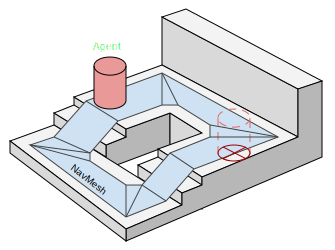

# Imperitus
Um jogo cooperativo de stealth e puzzle desenvolvido em Unity.

## Grupo

* Bruno Moreira (29561)
* Marco Alves de Sousa (27929)
* Vítor Guerra (27950)

## Introdução

### Descrição do Jogo
*Imperitus* é um jogo cooperativo multiplayer que combina elementos de stealth, exploração e resolução de puzzles.
Os jogadores trabalham em equipa para infiltrar locais mágicos, evitar inimigos inteligentes e resolver enigmas.

### Sistemas de IA Implementados

* **Pathfinding com NavMesh (A\*)**: Navegação inteligente usando o algoritmo A* através do sistema de NavMesh do Unity.
Permite que inimigos calculem rotas otimizadas, evitem obstáculos e persigam jogadores de forma eficiente.


* **Finite State Machine (FSM)**: Sistema de máquina de estados para comportamento de inimigos mais complexo e dinâmico.


* **Vosk Speech Recognition**: Modelo de reconhecimento de voz offline integrado no Library Reception Puzzle.
Processa comandos de voz em tempo real para criar puzzles cooperativos baseados em comunicação verbal.

## Implementação de Inteligência Artificial

### 1. Grimoire: Sistema de Pathfinding com NavMesh (Algoritmo A*)

O inimigo **Sentient Grimoire** utiliza o sistema de **NavMesh** do Unity para pathfinding, que internamente implementa 
uma variante otimizada do **algoritmo A***. Este sistema permite que os inimigos naveguem de forma inteligente pelo
ambiente.

#### Como funciona o A*

O algoritmo A* é um algoritmo de pathfinding que encontra o caminho mais curto entre dois pontos, combinando:
- **Custo Real (g)**: Distância já percorrida desde o início.
- **Heurística (h)**: Estimativa da distância até ao objetivo.
- **Custo Total (f)**: f = g + h

O Unity abstrai esta complexidade através do `NavMeshAgent`, mas a implementação subjacente segue estes princípios.

#### Arquitetura Interna do NavMesh

<picture>
  <source media="(prefers-color-scheme: dark)" srcset="Images/NavMeshUnderstandingAreas_Dark.svg">
  <source media="(prefers-color-scheme: light)" srcset="Images/NavMeshUnderstandingAreas_Light.svg">
  
</picture>

O NavMesh do Unity divide o ambiente em **polígonos convexos** durante o processo de baking:

1. **Baking**: O Unity utiliza o componente **NavMesh Surface** para definir áreas navegáveis.
Este componente analisa os colliders ou geometria de GameObjects, permitindo ainda controlo granular sobre quais objetos
contribuem para o NavMesh.
2. **Voxelização**: A geometria é convertida em voxels para análise espacial.
3. **Geração de Polígonos**: Áreas navegáveis são convertidas em polígonos convexos otimizados.
4. **Grafo de Navegação**: Polígonos adjacentes são conectados formando um grafo de navegação.

**Vantagens dos Polígonos Convexos:**
- Qualquer ponto dentro de um polígono pode ser alcançado em linha reta.
- Simplifica cálculos de pathfinding.
- Reduz o número de nós no grafo comparado com grids.

**Vantagens do NavMesh Surface:**
- Permite múltiplas superfícies de navegação independentes na mesma cena.
- Oferece controlo preciso sobre quais objetos são considerados (via layers).

#### Utilização Prática num Inimigo

O nosso inimigo "Sentient Grimoire", por exemplo, utiliza o `NavMeshAgent` para movimento desta forma:

```csharp
// Define o destino
ai.navAgent.SetDestination(targetPosition);

// Verifica se chegou ao destino
if (!ai.navAgent.pathPending && ai.navAgent.remainingDistance <= threshold)
{
    // Chegou ao destino
}
```

O NavMesh calcula automaticamente:
- O caminho mais curto usando A*.
- Suaviza a trajetória.
- Ajusta a velocidade em curvas e ao aproximar-se do destino.
- Recalcula rotas quando obstáculos (estáticos e dinâmicos) bloqueiam o caminho.

---

### 2. Grimoire: Sistema de State Machine (FSM)

O inimigo **Sentient Grimoire** é um livro voador que patrulha áreas com um holofote, detetando jogadores e chamando
reforços. A sua IA é implementada através de uma **Máquina de Estados Finita**.

#### Arquitetura da State Machine

A interface [`IEnemyState`](Assets/Scripts/Enemies/IEnemyState.cs) define o contrato para todos os estados:

```csharp
public interface IEnemyState
{
    void OnEnter();  // Chamado ao entrar neste estado
    void Update();   // Chamado a cada frame enquanto neste estado
    void OnExit();   // Chamado ao sair neste estado
}
```

##### Transição Entre Estados

As transições entre estados são geridas pelo método [`ChangeState`](Assets/Scripts/Enemies/BaseEnemy.cs#L52), que garante uma mudança limpa e consistente:

```csharp
public void ChangeState(IEnemyState newState)
{
    if (currentState == newState) return;
    currentState?.OnExit();   // Limpa o estado atual
    currentState = newState;
    currentState?.OnEnter();  // Inicializa o novo estado
}
```

**Fluxo de Transição:**
1. **Validação**: Verifica se o novo estado é diferente do atual (evita transições desnecessárias).
2. **OnExit**: Chama o método `OnExit()` do estado atual para limpeza (restaurar velocidade, parar timers, etc.).
3. **Atualização**: Atribui o novo estado como estado atual.
4. **OnEnter**: Chama o método `OnEnter()` do novo estado para inicialização (configurar parâmetros, iniciar animações,
etc.).

Esta arquitetura garante que cada estado pode preparar-se adequadamente ao ser ativado e limpar recursos ao ser
desativado.

#### Estados Implementados

A FSM do Grimoire é composta por três estados principais: **Patrol State**, **Alert State** e **Tracking State**.

<div style="text-align: center;">

<picture>
  <source media="(prefers-color-scheme: dark)" srcset="Images/Grimoire_FSM_Diagram_Dark.svg">
  <source media="(prefers-color-scheme: light)" srcset="Images/Grimoire_FSM_Diagram_Light.svg">
  
</picture>

</div>

##### **1. Patrol State ([`GrimoirePatrolState`](Assets/Scripts/Enemies/SentientGrimoire/GrimoirePatrolState.cs))**
O estado inicial onde o Grimoire patrulha entre waypoints predefinidos.

**Características:**
- Move-se entre waypoints utilizando o NavMesh Agent.
- Suporta rotas cíclicas ou lineares.
- Encontra o waypoint mais próximo ao iniciar e começa a patrulha a partir dele.
- Roda o holofote suavemente para a posição padrão.
- Transita para Alert State quando deteta um jogador.

**Implementação:**
```csharp
public void OnEnter()
{
    if (route == null || route.Count == 0)
    {
        ai.navAgent.isStopped = true;
        return;
    }

    // Encontra o waypoint mais próximo e inicia a patrulha a partir dele
    FindNearestWaypoint();
    MoveToWaypoint(currentWaypointIndex);
}

public void Update()
{
    if (ai.DetectedPlayer)
    {
        // Jogador detetado, transita para estado de alerta
        ai.ChangeState(ai.AlertState);
        return;
    }

    if (route == null || route.Count == 0) return;

    // Verifica se chegou ao waypoint atual
    if (!ai.navAgent.pathPending && ai.navAgent.remainingDistance <= waypointReachThreshold)
    {
        currentWaypointIndex++;
        if (currentWaypointIndex >= route.Count)
        {
            if (loop)
                currentWaypointIndex = 0;
            else
            {
                ai.navAgent.isStopped = true;
                return;
            }
        }
        MoveToWaypoint(currentWaypointIndex);
    }

    // Roda o holofote para a posição padrão
    ai.RotateSpotlightToDefault(2f);
}
```

##### **2. Alert State ([`GrimoireAlertState`](Assets/Scripts/Enemies/SentientGrimoire/GrimoireAlertState.cs))**
Estado intermediário ativado quando um jogador é detetado.

**Características:**
- Para o movimento do Grimoire.
- Rastreia o jogador com o holofote durante um período definido.
- Muda a cor do holofote para vermelho (alerta visual).
- Após o tempo de alerta, transita para Tracking State ou retorna a Patrol State caso tenha perdido o jogador de vista.

**Implementação:**
```csharp
public void OnEnter()
{
    ai.navAgent.isStopped = true;
    alertTimer = alertDuration;
}

public void Update()
{
    alertTimer -= Time.deltaTime;

    // Roda o holofote para rastrear o jogador
    Transform detectedPlayer = ai.DetectedPlayer;
    if (detectedPlayer)
    {
        ai.RotateSpotlightToTarget(detectedPlayer, 5f);
    }

    // Transição após duração do alerta
    if (alertTimer <= 0f)
    {
        if (detectedPlayer)
            ai.ChangeState(ai.TrackingState);
        else
            ai.ChangeState(ai.PatrolState);
    }
}
```

##### **3. Tracking State ([`GrimoireTrackingState`](Assets/Scripts/Enemies/SentientGrimoire/GrimoireTrackingState.cs))**
Estado onde o Grimoire persegue ativamente o jogador detetado.

**Características:**
- Persegue o jogador usando a NavMesh (pathfinding A*).
- Aumenta a velocidade de movimento.
- Mantém o holofote focado no jogador.
- Atualiza continuamente o destino para a posição do jogador.
- Retorna ao Patrol State se perder o jogador de vista.

**Implementação:**
```csharp
public void OnEnter()
{
    ai.navAgent.isStopped = false;
    ai.navAgent.speed = ai.trackingSpeed;
}

public void OnExit()
{
    ai.navAgent.speed = ai.patrolSpeed;
}

public void Update()
{
    Transform detectedPlayer = ai.DetectedPlayer;

    if (detectedPlayer)
    {
        ai.RotateSpotlightToTarget(detectedPlayer, 5f);
        ai.navAgent.SetDestination(detectedPlayer.position);
    }
    else
    {
        // Perdeu o jogador de vista, retorna à patrulha
        ai.ChangeState(ai.PatrolState);
    }
}
```

---

### 3. Vosk: Speech to Text AI Model

O nosso projeto utiliza o Vosk para implementar um puzzle cooperativo baseado em comunicação verbal.

O **Vosk** é um toolkit de reconhecimento de voz offline baseado em **Machine Learning** que converte fala em texto.
Utiliza **Deep Neural Networks (DNN)** e é baseado no **Kaldi**, um conhecido toolkit de reconhecimento de fala.

Para este projeto, utilizamos o **modelo small English** pré-treinado do Vosk (~50MB), que oferece um bom equilíbrio
entre precisão e performance para reconhecimento de voz em inglês. O modelo é carregado localmente a partir da pasta
`StreamingAssets/LanguageModels`, permitindo funcionamento completamente offline.

#### Características Técnicas do Vosk

**Vantagens:**
- **Offline**: Funciona sem ligação à internet.
- **Rápido**: Processamento em tempo real, ideal para jogos.
- **Preciso**: Boa taxa de reconhecimento para inglês.
- **Leve**: Modelo relativamente pequeno (~50MB para inglês).
- **Configurável**: Suporta gramáticas personalizadas para melhorar precisão.

#### Integração da API Vosk

A implementação requer a integração da **biblioteca C# do Vosk** no projeto Unity. Esta biblioteca C# funciona como
um wrapper em torno da **API nativa do Vosk em C**, fornecendo classes essenciais:
- **`Model`**: Classe que carrega e representa o modelo treinado de reconhecimento de fala.
- **`VoskRecognizer`**: Classe que processa os dados de áudio e retorna os resultados de reconhecimento.

Ambas as classes abstraem a complexidade de comunicar diretamente com a biblioteca nativa em C, fornecendo uma
interface C# amigável para processamento de reconhecimento de voz. Estas classes são então envolvidas pelos nossos
componentes personalizados (`VoskSpeechToText`, `VoiceProcessor`, `RecognitionResult`) para integração completa com 
o Unity.

#### Arquitetura da nossa implementação do Vosk

O sistema é composto por três componentes principais:

##### **1. [`VoskSpeechToText`](Assets/Scripts/Vosk/VoskSpeechToText.cs)**
Componente central que gere o modelo Vosk e processa reconhecimento.

**Características:**
- Suporta deteção de frases-chave específicas.
- Processa áudio em thread separada para evitar lag.
- Usa filas thread-safe (`ConcurrentQueue`) para comunicação entre threads.
- Inicialização assíncrona através de Coroutines.

**Inicialização:**
```csharp
public void StartVoskStt(string[] keyPhrases = null, string modelPath = null, 
    bool startRecording = false, int maxAlternatives = 3)
{
    if (m_isInitializing || m_didInit)
        return;

    if (!string.IsNullOrEmpty(modelPath))
        m_modelPath = modelPath;

    if (keyPhrases != null)
        this.keyPhrases = keyPhrases;

    this.maxAlternatives = maxAlternatives;
    StartCoroutine(DoStartVoskStt(startRecording));
}

private IEnumerator DoStartVoskStt(bool startRecording)
{
    m_isInitializing = true;
    yield return WaitForMicrophoneInput();

    m_decompressedModelPath = Path.Combine(Application.streamingAssetsPath, m_modelPath);

    OnStatusUpdated?.Invoke("Loading Model from: " + m_decompressedModelPath);
    m_model = new Model(m_decompressedModelPath);

    yield return null;

    OnStatusUpdated?.Invoke("Initialized");
    voiceProcessor.OnFrameCaptured += VoiceProcessorOnOnFrameCaptured;
    voiceProcessor.OnRecordingStop += VoiceProcessorOnOnRecordingStop;

    m_isInitializing = false;
    m_didInit = true;

    if (startRecording)
        StartRecording();
}
```

**Gramática Dinâmica:**
O sistema converte as frases-chave num array JSON para filtragem:
```csharp
private void UpdateGrammar()
{
    if (keyPhrases.Length == 0)
    {
        m_grammar = "";
        return;
    }

    JArray keywords = new JArray();
    foreach (string keyphrase in keyPhrases)
    {
        keywords.Add(keyphrase.ToLower());
    }
    keywords.Add("[unk]"); // Filtra palavras ou frases não reconhecidas

    m_grammar = keywords.ToString();
}
```

**Processamento Assíncrono:**
O processamento ocorre numa thread separada, usando filas thread-safe:
```csharp
private async Task ThreadedWork()
{
    if (!m_recognizerReady)
    {
        UpdateGrammar();

        // Cria reconhecedor com ou sem gramática
        if (string.IsNullOrEmpty(m_grammar))
            m_recognizer = new VoskRecognizer(m_model, 16000.0f);
        else
            m_recognizer = new VoskRecognizer(m_model, 16000.0f, m_grammar);

        m_recognizer.SetMaxAlternatives(maxAlternatives);
        m_recognizerReady = true;
    }

    while (m_running)
    {
        if (m_threadedBufferQueue.TryDequeue(out short[] voiceResult))
        {
            // Processa áudio com Vosk
            if (m_recognizer.AcceptWaveform(voiceResult, voiceResult.Length))
            {
                var result = m_recognizer.Result();
                m_threadedResultQueue.Enqueue(result);
            }
        }
        else
        {
            await Task.Delay(100); // Aguarda novos dados
        }
    }
}
```

##### **2. [`VoiceProcessor`](Assets/Scripts/Vosk/VoiceProcessor.cs)**
Gere a captura de áudio do microfone e entrega frames para processamento em tempo real.

**Características:**
- Captura áudio do microfone.
- Suporta múltiplos dispositivos de gravação com mudança dinâmica.
- Deteção automática de voz baseada em volume (opcional).
- Emite eventos `OnFrameCaptured` com arrays de samples que o `VoskSpeechToText` ouve e processa.

##### **3. [`RecognitionResult`](Assets/Scripts/Vosk/RecognitionResult.cs)**
Classe de dados que processa os resultados JSON do Vosk.

**Suporta três formatos de resultado:**
1. **Alternativas**: Quando o Vosk retorna várias interpretações possíveis.
2. **Resultado único**: Quando há apenas uma interpretação.
3. **Resultado parcial**: Durante o processamento contínuo de fala.

```csharp
public class RecognitionResult
{
    public RecognizedPhrase[] Phrases { get; }
    public bool Partial { get; private set; }

    public RecognitionResult(string json)
    {
        JObject resultJson = JObject.Parse(json);

        // Processa alternativas
        if (resultJson.TryGetValue("alternatives", out var alternativesToken))
        {
            var alternatives = (JArray)alternativesToken;
            Phrases = new RecognizedPhrase[alternatives.Count];
            for (int i = 0; i < Phrases.Length; i++)
            {
                Phrases[i] = new RecognizedPhrase(alternatives[i] as JObject);
            }
        }
        // Resultado único
        else if (resultJson.ContainsKey("result"))
        {
            Phrases = new RecognizedPhrase[] { new(resultJson) };
        }
        // Resultado parcial
        else if (resultJson.TryGetValue("partial", out var value))
        {
            Partial = true;
            Phrases = new RecognizedPhrase[] { new(value.ToString()) };
        }
        else
        {
            Phrases = new[] { new RecognizedPhrase() };
        }
    }
}

public class RecognizedPhrase
{
    public string Text { get; private set; } = string.Empty;  // Texto reconhecido
    public float Confidence { get; private set; } = 0f;       // Confiança

    public RecognizedPhrase(JObject json)
    {
        if (json.ContainsKey("confidence"))
            Confidence = json["confidence"].Value<float>();

        if (json.ContainsKey("text"))
            Text = json["text"].Value<string>().Trim();
    }
}
```

#### Library Reception Puzzle ([`LibraryReceptionPuzzle`](Assets/Scripts/Gameplay/LibraryReceptionPuzzle.cs))

O **Library Reception Puzzle** é um puzzle cooperativo onde os jogadores devem comunicar verbalmente para abrir
uma porta mágica.

##### Mecânica do Puzzle

1. **Distribuição de Palavras**: Palavras de uma frase são distribuídas entre jogadores como objetos visíveis apenas
para cada jogador.
2. **Comunicação**: Os jogadores devem comunicar para reconstruir a frase completa.
3. **Reconhecimento de Voz**: Um jogador deve dizer a frase completa perto da porta.
4. **Validação**: O servidor valida a frase e abre a porta se estiver correta.

##### Implementação

**Inicialização do Puzzle (Server):**
```csharp
private void InitializePuzzle()
{
    // Escolhe uma frase aleatória
    int sentenceIndex = Random.Range(0, PuzzleSentences.Length);
    m_targetSentenceIndex.Value = sentenceIndex;

    string targetSentence = PuzzleSentences[sentenceIndex].ToLower();
    string[] words = targetSentence.Split(new[] { ' ' }, StringSplitOptions.RemoveEmptyEntries);

    // Baralha spawn points para randomizar seleção
    objectSpawnPoints.Shuffle();

    // Obtém lista de clientes ativos
    var connectedClients = ServerManager.Clients.Values.Where(c => c.IsActive).ToList();
    
    for (int i = 0; i < words.Length; i++)
    {
        ObjectSpawnPoint spawnPoint = objectSpawnPoints[i];
        
        // Escolhe objeto aleatório dos permitidos no spawn point
        GameObject[] validObjects = spawnPoint.AllowedObjects.Where(obj => (bool)obj).ToArray();
        GameObject objectToSpawn = validObjects[Random.Range(0, validObjects.Length)];
        
        // Spawna o objeto de palavra
        GameObject spawnedObj = Instantiate(objectToSpawn, spawnPoint.transform.position, 
            spawnPoint.transform.rotation);
        
        if (spawnedObj.TryGetComponent(out WordCarrierObject wordCarrier))
        {
            m_spawnedWordObjects.Add(wordCarrier);
            wordCarrier.SetWord(words[i]);
            
            // Atribui visibilidade a cliente específico (distribuição round-robin)
            if (connectedClients.Count > 0)
            {
                int clientIndex = i % connectedClients.Count;
                int clientId = connectedClients[clientIndex].ClientId;
                wordCarrier.SetVisibleToClientId(clientId);
            }
        }
        
        Spawn(spawnedObj, scene: spawnPoint.gameObject.scene);
    }
}
```

**Configuração do Cliente:**
```csharp
private void SetupClientVoiceDetection()
{
    // Subscreve eventos de transcrição
    m_voskSpeechToText.OnTranscriptionResult += OnVoiceTranscription;

    // Inicia Vosk com todas as frases do puzzle como key phrases
    m_voskSpeechToText.StartVoskStt(keyPhrases: PuzzleSentences, startRecording: false);
}
```

**Deteção de Proximidade:**
```csharp
private void CheckPlayerProximity()
{
    if (!PlayerCharacter.LocalCharacter) return;

    float distance = Vector3.Distance(transform.position, PlayerCharacter.LocalCharacter.transform.position);

    // Inicia/para gravação baseado na proximidade
    if (distance <= hearingRadius && !m_voskSpeechToText.IsRecording)
    {
        m_voskSpeechToText.StartRecording();
    }
    else if (distance > hearingRadius && m_voskSpeechToText.IsRecording)
    {
        m_voskSpeechToText.StopRecording();
    }
}
```

**Processamento de Transcrição:**
```csharp
private void OnVoiceTranscription(string jsonResult)
{
    if (m_isDoorOpen.Value) return;

    RecognitionResult recognitionResult = new RecognitionResult(jsonResult);

    // Ignora resultados parciais
    if (recognitionResult.Partial || recognitionResult.Phrases == null || recognitionResult.Phrases.Length == 0) 
        return;

    string targetSentence = PuzzleSentences[m_targetSentenceIndex.Value].ToLower();

    // Verifica cada frase reconhecida
    foreach (RecognizedPhrase phrase in recognitionResult.Phrases)
    {
        if (string.IsNullOrEmpty(phrase.Text)) continue;

        // Compara com frase alvo (case-insensitive)
        if (string.Equals(phrase.Text, targetSentence, 
            StringComparison.CurrentCultureIgnoreCase))
        {
            // Envia para servidor para validação
            ServerValidateAndOpenDoor(phrase.Text);
            return;
        }
    }
}
```

#### Exemplo de Frases no Puzzle

O puzzle inclui mais de 40 frases criativas de 4 palavras cada, abaixo estão algumas delas:

```csharp
"The dragon ate homework"
"Mermaids gossip at dawn"
"Witches hate pop quizzes"
"A phoenix fears rain"
"Magic hides in hallways"
"Vampires dread sunlight class"
// ... e muitas mais
```

---

## Conclusão

Este projeto explora três abordagens distintas de IA aplicadas ao contexto de um jogo cooperativo: navegação 
inteligente através de pathfinding, comportamento modular com máquinas de estado, e interação por voz usando 
reconhecimento de fala offline.

Cada sistema representa um desafio técnico diferente - desde otimizar caminhos em ambientes 3D complexos, gerir 
transições de estado coerentes, até processar áudio em tempo real sem impactar a performance do jogo. O resultado é 
uma experiência onde tecnologia e gameplay se entrelaçam para criar momentos únicos de cooperação e tensão.

A implementação destes sistemas serviu como uma excelente oportunidade de aprendizagem sobre os fundamentos práticos de
IA em desenvolvimento de jogos.

---

*Desenvolvido como projeto académico para exploração de técnicas de IA em desenvolvimento de jogos.*
